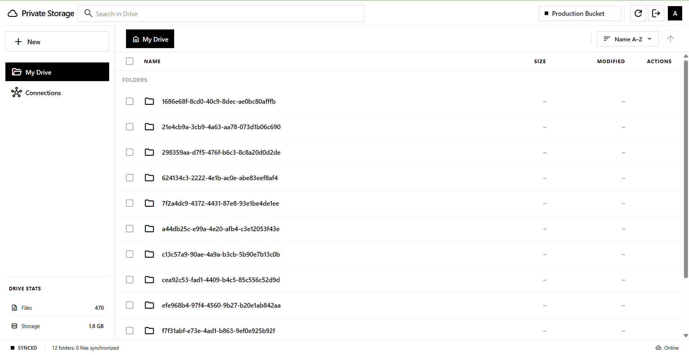
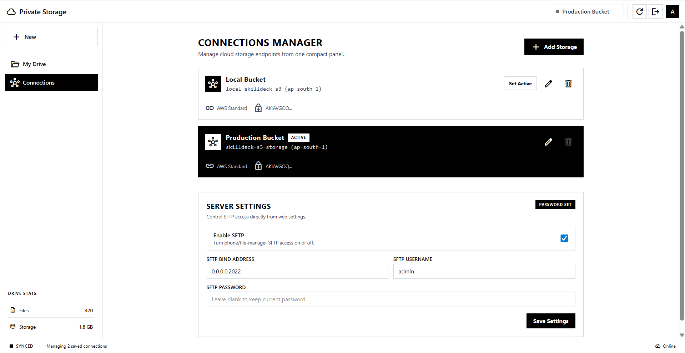

# 🛡️ Private Storage

A secure, modern S3-compatible cloud storage explorer. Manage multiple cloud storage accounts with ease using a high-performance Go backend and a responsive React interface.

<p align="center">
  
</p>
<p align="center">
  
</p>
<p align="center">
   
</p>

## ✨ Highlights
- **Multi-Tenant Ready**: Add and manage multiple S3 storage profiles (AWS, MinIO, R2, Wasabi).
- **SQLite Persistence**: Admin identity + connections are persisted in SQLite (`config/private-storage.db`).
- **Encryption at Rest**: S3 Access/Secret keys are AES-GCM encrypted before being written to SQLite.
- **Hardened Auth**: Admin password is stored as a bcrypt hash (not plaintext).
- **Dynamic Switching**: Swap between active buckets instantly via the dashboard.
- **Preview + Direct Download**: Preview opens in a new tab, while Download triggers a real file download.
- **Built-in SFTP Bridge**: SFTP uses the same active web connection for consistent file access.
- **Web Settings Panel**: Enable/disable and configure SFTP directly from Connections page.
- **Optional HTTPS**: Native TLS support via cert/key environment variables.
- **Modern Stack**: Built with Go 1.22+, React 18+, and Tailwind CSS.
- **Security First**: Presigned URL support for secure uploads/downloads.

---

## 🐳 Quick Start (No Code)

If you do not want to clone the repo or build anything, run the prebuilt image directly.

### Option A: One command (docker run)

1. Pull image:
    ```bash
    docker pull shuheb04/private-cloud:latest
    ```

2. Run container:
    ```bash
    docker run -d \
       --name private-cloud \
       -p 8080:8080 \
       -p 2022:2022 \
       -v private-cloud-config:/app/config \
       -e AUTH_USERNAME=admin \
       -e AUTH_PASSWORD=admin@123 \
       -e SFTP_ENABLED=false \
       shuheb04/private-cloud:latest
    ```

3. Open app:
    - Web UI: `http://localhost:8080`
    - Login: `admin` / `admin@123`

### Option B: Prebuilt image with docker compose

Create `docker-compose.yml`:

```yaml
services:
   app:
      image: shuheb04/private-cloud:latest
      ports:
         - "8080:8080"
         - "2022:2022"
      volumes:
         - private-cloud-config:/app/config
      environment:
         AUTH_USERNAME: admin
         AUTH_PASSWORD: admin@123
         SFTP_ENABLED: "false"
      restart: unless-stopped

volumes:
   private-cloud-config:
```

Start:

```bash
docker compose up -d
```

### Upgrade to latest image

```bash
docker pull shuheb04/private-cloud:latest
docker stop private-cloud
docker rm private-cloud
docker run -d \
   --name private-cloud \
   -p 8080:8080 \
   -p 2022:2022 \
   -v private-cloud-config:/app/config \
   -e AUTH_USERNAME=admin \
   -e AUTH_PASSWORD=admin@123 \
   -e SFTP_ENABLED=false \
   shuheb04/private-cloud:latest
```

---

## 🐳 Quick Start (Repo + Docker Compose)

If you want local source files and full project control:

1. **Clone & Launch**:
   ```bash
   git clone https://github.com/yourusername/private-storage.git
   cd private-storage
   docker compose up -d
   ```

2. **Login & Setup**:
   - Access the dashboard at `http://localhost:8080`.
   - Login with default credentials: `admin` / `admin@123`.
   - Go to the **Connections Manager** to add your first storage bucket.
   - Optional: configure SFTP in **Connections -> Server Settings**.

3. **Optional SFTP Access**:
   - Connect your phone/file manager to `<host>:2022`.
   - SFTP uses the same active storage connection selected in the web UI.

---

## ⚙️ Configuration

While storage is managed via the UI, you can set these environment variables in your `.env` for the server setup:

| Variable | Description | Default |
|----------|-------------|---------|
| `AUTH_USERNAME` | Master Admin Username | `admin` |
| `AUTH_PASSWORD` | Master Admin Password | `admin@123` |
| `ADMIN_API_KEY` | Optional API key for non-cookie API access (`Authorization: Bearer ...` / `X-API-Key`) | empty |
| `SERVER_ADDR` | Server bind address | `0.0.0.0:8080` |
| `CONFIG_DB_PATH` | SQLite file path for app state | `config/private-storage.db` |
| `SFTP_ENABLED` | Enable built-in SFTP server bound to active web connection | `false` |
| `SFTP_ADDR` | SFTP bind address | `0.0.0.0:2022` |
| `SFTP_USER` | SFTP username | empty |
| `SFTP_PASSWORD` | SFTP password | empty |
| `TLS_CERT_FILE` | Path to TLS cert PEM (enables HTTPS when set with key) | empty |
| `TLS_KEY_FILE` | Path to TLS private key PEM | empty |
| `APP_SECRET` | Secret used for credential encryption | (Auto-generated) |

Notes:
- If `TLS_CERT_FILE` + `TLS_KEY_FILE` are set, server starts with HTTPS.
- SFTP can also be configured at runtime from the web settings page.

---

## 🛠️ Run from Source

### 1. Backend (Go)
```bash
go run main.go
```

### 2. Frontend
```bash
cd frontend
npm install
npm run dev
```

---

## 🔐 Security Note
All storage credentials added through the dashboard are stored in SQLite (`config/private-storage.db`). To protect these keys, the application encrypts access/secret keys at rest using AES-GCM. For production deployments:

- set a custom `APP_SECRET`
- run behind HTTPS (or set `TLS_CERT_FILE` + `TLS_KEY_FILE`)
- set `ADMIN_API_KEY` only if you need token-based API access

### Samsung / Phone Access
Built-in SFTP is available now. When enabled, SFTP always uses the same active connection selected in the web UI, so list/upload/download stay in sync.

Quick setup:

1. Set `SFTP_ENABLED=true`
2. Set `SFTP_USER` and `SFTP_PASSWORD`
3. Start app and connect phone file manager to `<host>:2022` over SFTP

### File Access Behavior (Web)
- **Preview**: opens the file in a new browser tab.
- **Download**: triggers an actual attachment download.

---
## 📄 License
This project is licensed under the MIT License - see the [LICENSE](LICENSE) file for details.

---
Made with ❤️ for private storage.
