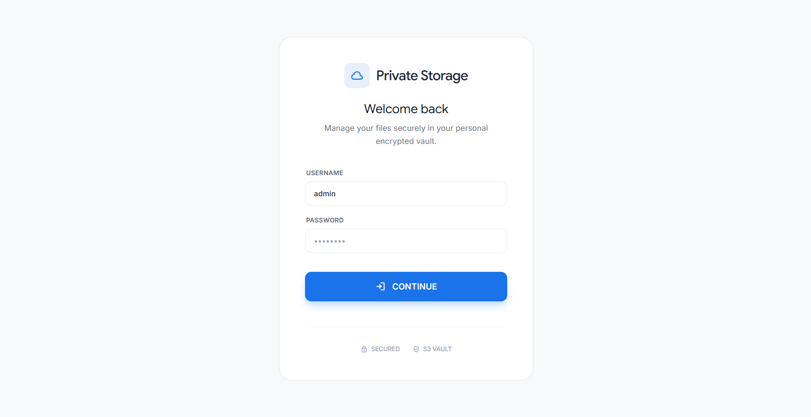
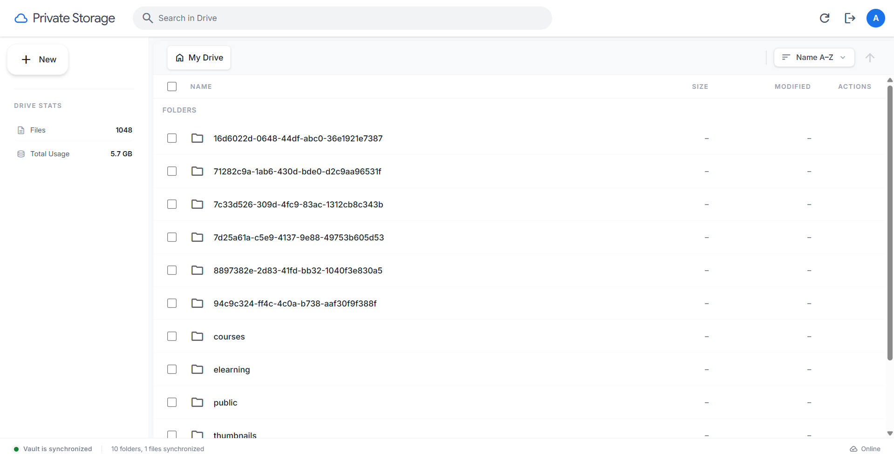

# 🛡️ Private Storage

A secure, modern S3-compatible cloud storage explorer. Manage multiple cloud storage accounts with ease using a high-performance Go backend and a responsive React interface.

<p align="center">
  
  
</p>

## ✨ Highlights
- **Multi-Tenant Ready**: Add and manage multiple S3 storage profiles (AWS, MinIO, R2, Wasabi).
- **Encryption at Rest**: Your storage credentials (Access/Secret keys) are AES-GCM encrypted in settings.
- **Dynamic Switching**: Swap between active buckets instantly via the dashboard.
- **Modern Stack**: Built with Go 1.22+, React 18+, and Tailwind CSS.
- **Security First**: Presigned URL support for secure uploads/downloads.

---

## 🐳 Quick Start (Docker)

The fastest way to run Private Storage is using Docker.

1. **Clone & Launch**:
   ```bash
   git clone https://github.com/yourusername/private-storage.git
   cd private-storage
   docker compose up -d
   ```

2. **Login & Setup**:
   - Access the dashboard at `http://localhost:8080`.
   - Login with default credentials: `admin` / `admin@123`.
   - Go to the **Connections Manager** to add your first storage bucket.

---

## ⚙️ Configuration

While storage is managed via the UI, you can set these environment variables in your `.env` for the server setup:

| Variable | Description | Default |
|----------|-------------|---------|
| `AUTH_USERNAME` | Master Admin Username | `admin` |
| `AUTH_PASSWORD` | Master Admin Password | `admin@123` |
| `SERVER_ADDR` | Server bind address | `0.0.0.0:8080` |
| `DB_HOST` | Database Host | `localhost` |
| `DB_PORT` | Database Port | `5432` |
| `DB_USER` | Database User | `postgres` |
| `DB_PASSWORD` | Database Password | `postgres` |
| `DB_NAME` | Database Name | `private_storage` |
| `APP_SECRET` | Secret used for credential encryption | (Auto-generated) |
| `DATABASE_URL` | Full Postgres connection string | (Derived from above) |

---

## 🛠️ Database & Table Creation

Private Storage uses **PostgreSQL + TimescaleDB**. You do **not** need to create tables manually.

1.  **Requirement**: Ensure you have TimeScaleDB running (the Docker Compose setup includes this automatically).
2.  **Automatic Migrations**: When you run the Go backend, it automatically checks the `internal/db/migrations/` directory and applies any pending SQL scripts to your database.
3.  **Bootstrap**: On the first run, the system will automatically create the `users`, `connections`, `jobs`, and `object_usage` tables.

---

---

## 🚀 The Vision: Storage Insight v2.0

We are evolving. The next major milestone transitions **Private Storage** from a simple file explorer into a definitive **Community Utility for Storage Observability**.

- **Phase 1: Foundation**: Moving to a PostgreSQL + TimescaleDB backend to handle large-scale usage tracking reliably.
- **Phase 2: Insight**: Ingesting S3 Inventory Reports to highlight "Storage Waste" (orphan uploads, ghost data) for every developer.
- **Phase 3: Sovereignty**: Mapping egress costs and simulating cloud migrations to empower users to avoid cloud lock-in.

Check out the detailed **[Community Roadmap](docs/plan/04_release_schedule.md)** to see how we are building this for the developer community.

---

### 1. Backend (Go)
Ensure your database is running, then start the server. Migrations will run automatically.
```bash
go run main.go
```

### 2. Frontend
```bash
cd frontend
npm install
npm run dev
```

---

## 🔐 Security Note
All storage credentials added through the dashboard are stored in `config/config.json`. To protect these keys, the application automatically encrypts them at rest using AES-GCM. For production deployments, it is recommended to set a custom `APP_SECRET` environment variable.

---
## 📄 License
This project is licensed under the MIT License - see the [LICENSE](LICENSE) file for details.

---
Made with ❤️ for private storage.
